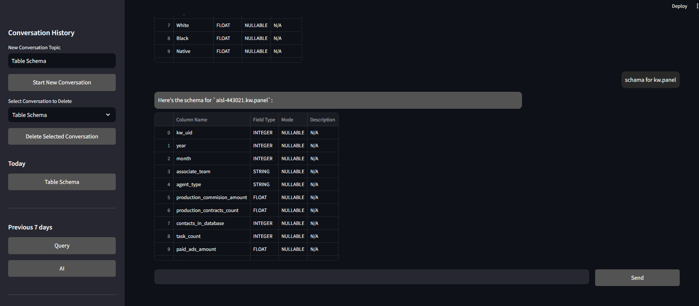

# BigQuery Chatbot

BigQuery Chatbot is an intelligent conversational AI that interacts with Google BigQuery to fetch and analyze data. It integrates **LangChain, Streamlit, and LangSmith** for real-time query execution, schema inspection, and chatbot monitoring.

## 🌟 Key Features

✅ **Conversational AI**: Uses Google Generative AI (Gemini) for intelligent responses.  
✅ **BigQuery Integration**: Fetches schemas and executes queries in real-time.  
✅ **Session-based Memory**: Maintains persistent conversation history.  
✅ **LangSmith Integration**: Tracks and evaluates chatbot performance.  
✅ **Streamlit UI**: User-friendly web interface for interacting with BigQuery.  

---

## Quick Start Guide

### 1. **Clone the Repository**
```bash
git clone https://github.com/AI-Solutions-Lab-LLC/hd.git
cd bigquery_chatbot
```

### 2. **Set Up a Virtual Environment**
```bash
python -m venv venv
source venv/bin/activate  # On macOS/Linux
venv\Scripts\activate      # On Windows
```

### 3. **Install Dependencies**
```bash
pip install -r requirements.txt
```

### 4. **Set Up Environment Variables**
To configure the chatbot, create a `.env` file by copying the provided `.env.template`:
```bash
cp .env.template .env
```

Then, open `.env` and update the values with your Google Cloud and LangSmith API credentials:
```bash
GOOGLE_API_KEY=your_api_key_here
GOOGLE_APPLICATION_CREDENTIALS=/path/to/your_gcp_json_key.json
PROJECT_ID=your_bigquery_project_id
DATASET_ID=your_bigquery_dataset_name
LANGCHAIN_PROJECT=your-langsmith-project
LANGCHAIN_API_KEY=your-langsmith-api-key
```

Note: Make sure to provide the correct **Google Cloud service account JSON key** to authenticate BigQuery access.

### 5. **Run the Streamlit App**
```bash
streamlit run streamlit_app.py
```

---

## Usage Guide

### 🚀 Fetching Table Schema
Chatbot can retrieve the schema of a BigQuery table. Example prompt:




### 🚀 Executing Queries
You can execute SQL queries using natural language prompts:


---

##  Project Structure
```bash
bigquery_chatbot/
│── src/
│   ├── agent.py              # Defines LangChain agent
│   ├── tools.py              # Tools for fetching schema and executing queries
│   ├── bigquery_manager.py   # Handles BigQuery interactions
│   ├── sql_lite_handler.py   # Manages SQLite database for chat history
│   ├── format_message.py     # Formats the LLM response for display
│   ├── utils/
│       ├── config.py         # Database configurations
│── streamlit_app.py          # Streamlit UI
│── requirements.txt          # Dependencies
│── README.md                 # Documentation
```

---

##  LangSmith Integration
LangSmith is used to **trace, monitor, and evaluate** chatbot performance in real-time.

### Step 1: Set Up LangSmith
1. **Go to LangSmith** ➡️ [LangSmith Platform](https://smith.langchain.com/)
2. **Create a Project and Generate an API Key** (If you haven't already).
3. **Update Your `.env` File** with the LangSmith details:

    ```env
    LANGCHAIN_PROJECT=your-langsmith-project-name
    LANGCHAIN_API_KEY=your-langsmith-api-key
    ```

### Step 2: Integrating LangSmith in the Chatbot
Add the following code snippet to ensure LangSmith is tracking all interactions:

```python
from langchain.callbacks.tracers import LangChainTracer
from dotenv import load_dotenv
import os

# Load API keys from environment variables
load_dotenv()
langsmith_tracer = LangChainTracer()

llm = ChatGoogleGenerativeAI(
    model="gemini-1.5-pro",
    temperature=0,
    max_tokens=None,
    callbacks=[langsmith_tracer],
)
```

Now, all chatbot interactions will be logged in LangSmith!

### Step 3: Tracking & Monitoring in LangSmith
Once the chatbot is running, you can track its performance via the LangSmith Dashboard.


---